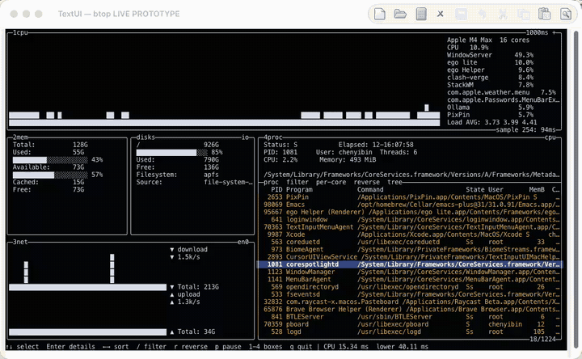

# TextUI

TextUI is a small UI runtime for Emacs package authors who want to build
responsive, long-running interactive buffers on top of `widget.el`.

Your package keeps its state in ordinary Lisp values and supplies a render
function. TextUI gives that function the available width, lays out the returned
elements, creates native `widget.el` controls, and redraws the buffer when its
width changes. It also coordinates state updates, preserves point, replaces
bounded regions, and ties timers and asynchronous callbacks to the buffer's
lifecycle.

TextUI is not a replacement widget library. Buttons, editable fields, toggles,
validation, and package-defined controls still belong to `widget.el`. TextUI
adds the runtime and layout capabilities around those controls: state-driven
refresh, lifecycle effects, Flex, Grid, width-aware text, and image placement.

TextUI requires Emacs 29.1 or newer and has no external runtime dependencies.

## Is TextUI a fit for your package?

TextUI is useful when your package needs a dashboard, inspector, settings
screen, file browser, process monitor, or another interactive buffer that must
adapt to different window widths. It is a particularly good fit when you want
to keep using native Emacs widgets but do not want to calculate their positions
by hand.

TextUI does not manage window layouts, divide an application across several
buffers, allocate height, or fetch and parse application data. It is also not
intended to replace ordinary editable major modes.

The responsibility split is deliberate:

- `widget.el` owns controls, input behavior, validation, and custom widget
  definitions.
- TextUI owns buffer state coordination, resource lifecycle, refresh,
  reconciliation, focus preservation, and responsive layout.
- Your package owns domain data, commands, parsing, and the render function.

## Design constraints

TextUI borrows two ideas from htmx as engineering constraints:
[architectural sympathy](https://htmx.org/essays/architectural-sympathy/) and
[locality of behaviour](https://htmx.org/essays/locality-of-behaviour/).
This is an analogy, not a Web programming model for Emacs.

- Use native Emacs and `widget.el` facilities before adding a TextUI concept.
- Keep a behaviour's declaration beside the element, state route, or effect it
  governs; keep its implementation in ordinary Lisp functions.
- Replace the complete frame or an explicitly named complete-line region. Do
  not maintain a parallel component tree or infer a reactive dependency graph.
- Extract a framework primitive only after a capability prototype shows a
  repeated problem that existing composition cannot solve.

The analogy stops at the platform boundary: TextUI has no server, hypermedia,
network request lifecycle, or htmx-compatible attributes. The complete
decision and the admission tests for future abstractions are recorded in
[ADR 0033](docs/adr/0033-textui-extends-widget-el-instead-of-replacing-it.md).

## See TextUI in action



The btop demo combines responsive panels, live data, interaction, and
independently refreshed regions. More recordings cover
[Flex layout](docs/media/textui-flex.gif),
[Grid layout](docs/media/textui-grid.gif),
[the 10,000-row K9s viewport](docs/media/textui-k9s-10k-adaptive-viewport.gif),
and [Lazygit-style panels](docs/media/textui-lazygit.gif).

## Releases

The current release is 0.4.0. See the [changelog](CHANGELOG.md) for the complete
version history. The measured refresh improvements and their fixture scope are
summarized in [Performance history](CHANGELOG.md#performance-history); runnable
diagnostics remain under
[`test/performance/`](test/performance/README.md).

## Load TextUI from a checkout

Until TextUI is installed as a package, add its directory to `load-path`:

```elisp
(add-to-list 'load-path "/path/to/textui")
(require 'textui)
```

Both `textui.el` and `textui-kp-core.el` must remain in that directory.

## A first interface

This is a complete counter owned by another package:

```elisp
(require 'textui)

(defun my-package-dashboard--frame (_width)
  `((:type :flex
     :direction :row
     :gap 2
     :children
     ((:type item
       :format "%v"
       :value ,(format "Count: %d" (plist-get textui-state :count)))
      (:type push-button
       :value "Increment"
       :layout (:focus-id increment)
       :action ,(lambda (&rest _)
                  (textui-set-state (current-buffer) :count #'1+)))))))

(defun my-package-dashboard ()
  (interactive)
  (textui-open "*My package*" #'my-package-dashboard--frame '(:count 0)))
```

Evaluate the definitions and run `M-x my-package-dashboard`. The render
function receives the current available width and returns a proper list of
interface-element plists. The `push-button` is an ordinary `widget.el` control.
Its `:action` updates the buffer state and queues one render; TextUI then
restores point to the button.

The working model is small:

```text
state + available width -> render function -> widget.el buffer
declared state routes     -> affected refresh-region producers
declared effects          -> managed timers, processes, and subscriptions
```

The render function is the evaluation seam. Compute final property values and
declare buffer-level effects there. TextUI does not add a binding language, a
second widget system, or a virtual DOM.

## Keep buffer state and resources together

`textui-state` is one ordinary buffer-local Lisp value. Supplying the optional
third argument to `textui-open` installs its initial value before the first
render. Calling `textui-open` later without that argument preserves the current
state.

`textui-update` passes the current value to an updater, stores its return value,
and requests one refresh. Several updates before Emacs processes its next timer
event are combined. For plist state, TextUI identifies changed top-level keys
and uses any matching state routes. If every changed key is covered, it skips
the complete render function and runs only the affected region producers.
Otherwise it reconciles the complete frame, preserving unchanged named regions
when possible. If the updater signals an error, the old state is retained.

For plist state, `textui-set-state` updates one key. Its value may be a literal
or a function of the previous value:

```elisp
(textui-set-state buffer :count #'1+)
```

Declare a conditional timer, process, or subscription with `textui-effect`.
TextUI runs its setup after the frame is committed. It retains the resource
while the dependencies remain `equal`, runs the returned cleanup before they
change, and also cleans it up when the effect disappears or the buffer dies:

```elisp
(textui-effect
 'poller
 (list (plist-get textui-state :paused))
 (lambda ()
   (unless (plist-get textui-state :paused)
     (let* ((tick
             (textui-async-callback
              (lambda ()
                (textui-set-state
                 (current-buffer) :ticks
                 (lambda (ticks) (1+ (or ticks 0)))))))
            (timer (run-with-timer 0 1 tick)))
       (lambda () (cancel-timer timer))))))
```

`textui-async-callback` restores the owning buffer for the callback and ignores
late calls after its effect has stopped. The same wrapper can be used as a
process sentinel. The effect cleanup should cancel the timer, process, or
subscription it created. For an unconditional resource that does not depend on
rendered state, `textui-register-cleanup` remains available.

Effects are reconciled when the complete render function is evaluated. A state
key used by an effect or by the surrounding layout must therefore remain
unrouted; its normal `textui-update` or `textui-set-state` then falls back to a
complete render and reevaluates the effect.

## Choose an element

Every interface element is a plist with a `:type`.

| Type             | Use it for                                                           |
|------------------|----------------------------------------------------------------------|
| `:flex`          | A responsive row or a vertical stack                                 |
| `:grid`          | Equal-width tracks that reduce their column count when space shrinks |
| `:text`          | Multi-line prose that reflows at its allocated pixel width           |
| `:image`         | An Emacs-supported image fitted into a fixed number of text rows     |
| Any other symbol | A registered package expander or a single-line `widget.el` type      |

Keyword types belong to TextUI. Other symbols first look for an explicitly
registered expander and otherwise go directly to `widget.el`.

### Flex

A row starts from each child's natural or declared width. It distributes spare
space according to `:grow`, shrinks layout elements toward `:min-width`, and
then wraps later children in source order:

```elisp
(:type :flex
 :direction :row
 :gap 1
 :children
 ((:type :flex
   :direction :column
   :border t
   :padding 1
   :layout (:width 24 :min-width 16 :grow 1)
   :children (...))
  (:type :flex
   :direction :column
   :border t
   :padding 1
   :layout (:width 24 :min-width 16 :grow 2)
   :children (...))))
```

A column stacks its children and uses `:gap` blank lines between them. TextUI
does not distribute vertical space.

Options used by a parent belong under `:layout`:

| Option        | Meaning                                                            |
|---------------|--------------------------------------------------------------------|
| `:width`      | Starting width in character cells                                  |
| `:min-width`  | Smallest width a layout element may take before its flex row wraps |
| `:grow`       | Non-negative weight for sharing spare width                        |
| `:focus-id`   | Stable point-restoration identity supplied by your package         |
| `:refresh-id` | Name of a replaceable complete-line column region                  |

For a bordered or padded layout element, its allocated width includes the
border and padding. Native widgets cannot use `:min-width` because TextUI cannot
make their own presentation narrower.

### Grid

Grid places children into equal-width tracks in source order:

```elisp
(:type :grid
 :columns 3
 :min-column-width 26
 :gap 1
 :children (...))
```

`:columns` is the maximum column count. As the window narrows, Grid uses fewer
columns before crossing `:min-column-width`. Each row takes the height of its
tallest cell. TextUI v1 does not provide explicit track expressions or row and
column spans.

### Reflowing text

Use `:text` for prose that must wrap. A native `item` remains one atomic line.

```elisp
(:type :text
 :value "A paragraph that should follow the width of its card."
 :layout (:min-width 24 :grow 1))
```

TextUI subtracts the parent's border and padding, converts the remaining cells
to pixels, and applies its vendored Knuth–Plass core. The optimizer chooses
breaks globally from each real gap's ideal, shrink, and stretch widths. Non-final
lines then distribute the required adjustment through those gaps; they do not
fake a full line with trailing filler. The last line remains naturally
ragged-right. Source characters and source offsets are retained so point can
follow the same text after reflow.

The Knuth–Plass implementation in `textui-kp-core.el` is adapted from Kinney
Zhang's [`emacs-kp`](https://github.com/Kinneyzhang/emacs-kp), specifically
[`e823d89`](https://github.com/Kinneyzhang/emacs-kp/commit/e823d89a4a5097dce0316ba66c83cf44e98f3aa8).
TextUI vendors the smaller subset it needs for pixel measurement, Latin/CJK
boxing, kinsoku rules, global line breaking, and glue allocation, so packages
using TextUI do not need a separate `emacs-kp` installation.

Give justified prose a reasonable minimum width. At very narrow widths,
the emergency pass may need visibly wide word spacing to fill a line. If that
pass would exceed the content width, TextUI instead wraps the whole paragraph
with natural ragged-right spacing. Only an indivisible token wider than the
content can still overflow. A package that supports a very narrow window should
return a more compact frame or place the prose on a row of its own.

### Images

An image leaf fits a file supported by the running Emacs into an allocated
width and a row count chosen by your package:

```elisp
(:type :image
 :file "/path/to/preview.png"
 :rows 12
 :alt "preview.png"
 :layout (:width 40 :min-width 12 :grow 1))
```

Graphical Emacs preserves the image's aspect ratio, centers it, and does not
enlarge it beyond its source size. TextUI presents the image as horizontal
slices so one buffer line does not become taller than its Flex or Grid
siblings. A non-graphical Emacs displays `:alt`, or the file name, in a block
with the same row count.

The caller chooses `:rows`; TextUI does not allocate window height.

## Use native and package-defined widgets

An ordinary non-keyword type is passed to `widget.el`:

```elisp
(:type editable-field
 :format "%v"
 :size 20
 :value "Ada"
 :layout (:focus-id package-name)
 :notify (lambda (widget &rest _)
           (setq my-package-name (widget-value widget))))
```

Native widgets must produce exactly one logical line during measurement and the
real presentation must have the same width. TextUI can move or pad an atomic
widget, but it cannot shorten its label, editable area, or image glyph. See
[`docs/widget-compatibility.md`](docs/widget-compatibility.md) for the tested
sample of built-in and package-owned widgets.

### Opt an existing widget into the fast path

TextUI normally creates a native widget once for measurement and again in the
real buffer. A package-owned widget can avoid both creation passes by adding two
ordinary widget type properties:

```elisp
(require 'textui-widgets)

(define-widget 'my-package-save-button 'push-button
  "My package's existing Save button."
  ;; Its existing creation code presents the same "[ LABEL ]" text.
  :textui-measure #'textui-widgets-measure-button
  :textui-attach #'textui-widgets-attach-button)
```

The package continues to use its own type:

```elisp
(:type my-package-save-button
 :value "Save"
 :action my-package-save)
```

`:textui-measure` receives the converted widget and must return the exact
single-line string that its ordinary creation code would present.
`:textui-attach` receives that widget plus the bounds of the already inserted
string and attaches normal widget.el behavior without changing its width.
These properties are inherited through `define-widget`; no TextUI registration
or replacement type is required.

`textui-widgets.el` exports matching pairs for three common presentation
contracts:

| Existing widget presentation | Measurement function                    | Attachment function              |
|------------------------------|-----------------------------------------|----------------------------------|
| Padded text button           | `textui-widgets-measure-button`         | `textui-widgets-attach-button`   |
| Text-only checkbox           | `textui-widgets-measure-checkbox`       | `textui-widgets-attach-checkbox` |
| Fixed-width editable field   | `textui-widgets-measure-field`          | `textui-widgets-attach-field`    |

The library also contains `textui-button`, `textui-checkbox`, and
`textui-field` as small examples of the protocol. They are not a recommended
widget layer. Package authors should continue to define controls with
`widget.el`, then add the two fields to those package-owned types when the fast
path is useful. A display convention not covered above may supply its own two
functions.

A widget's `:action` causes one automatic reconciled refresh after a normal
return, unless it already requested or performed a refresh. `widget.el` owns
`:notify`; TextUI does not refresh implicitly after it. Call `textui-update` or
a refresh function if a `:notify` callback changes other visible content.

## Decide how to refresh

Your package owns its state and data sources. Change that state first, then
choose the smallest refresh that matches the change.

| Change source                                               | What to call                                            |
|-------------------------------------------------------------|---------------------------------------------------------|
| `textui-state` changed                                      | `textui-update`                                         |
| Native widget `:action` changed external state              | Nothing; TextUI performs one refresh automatically      |
| External data changed across the frame                      | `textui-request-refresh`                                |
| A complete-line column must change immediately              | `textui-refresh-region`                                 |
| Frequent external updates to one complete-line column       | `textui-request-refresh-region`                         |

### Reconciled or full refresh

Keep the buffer returned by `textui-open` and refresh it after external state
changes:

```elisp
(defvar my-package-buffer nil)

(setq my-package-buffer
      (textui-open "*My package*" #'my-package-dashboard--frame))

;; Later, after a timer or process callback updates package state:
(textui-request-refresh my-package-buffer)
```

`textui-open` reuses one stable TextUI buffer with the requested name. It
signals an error rather than taking over an existing non-TextUI buffer.
`textui-request-refresh` combines a burst into one refresh on the next timer
event. It regenerates the frame description, patches only changed named regions
when the surrounding frame is stable, and otherwise rebuilds the complete
buffer. Use `textui-refresh` when a complete rebuild must finish synchronously.

### Bounded refresh

For a large or frequently changing panel, mark a column Flex container with a
refresh ID:

```elisp
(:type :flex
 :direction :column
 :gap 0
 :layout (:refresh-id rows)
 :children (...))
```

When top-level plist keys affect only that region, declare their route from the
same render function:

```elisp
(textui-route-state
 'rows
 '(:selected :filter)
 #'my-package--row-elements)
```

The route must name a refresh region present in that render. Its producer reads
the current `textui-state`, receives the region's current content width, and
returns replacement children. After this declaration, either of these updates
automatically refreshes only `rows`:

```elisp
(textui-set-state buffer :selected next-row)

(textui-update
 buffer
 (lambda (state)
   (let ((next (copy-sequence state)))
     (setq next (plist-put next :selected next-row))
     (plist-put next :filter query))))
```

All changed keys must have routes. If one key is undeclared, TextUI uses a
complete render because that key may affect the frame shell, layout, or an
effect. Updaters should replace top-level plist values rather than mutate
nested values in place so changed keys remain observable.

Replace only that region at its current width:

```elisp
(textui-refresh-region
 buffer 'rows
 (lambda (content-width)
   (render-visible-row-elements content-width)))
```

The producer returns the new children for the existing column. It should read
state that your package has already loaded; database and process I/O do not
belong inside the producer.

A refresh region must occupy one continuous block of complete buffer lines. It
cannot be a cell inside a Flex row or Grid because those lines also contain its
siblings. Region refresh keeps the region's current width. Use a full refresh
when surrounding layout or window width may have changed.

When a widget `:action` calls `textui-refresh-region` itself, TextUI sees that
the buffer has already changed and does not follow it with another automatic
refresh.

Without a matching state route, `textui-update` renders the new frame
description and automatically preserves unchanged named regions:

```elisp
(textui-update
 buffer
 (lambda (state)
   (plist-put (copy-sequence state) :selected next-row)))
```

This fallback path computes the complete layout so it can safely detect
structural changes. For external data that does not live in `textui-state`,
pass `:region` and `:producer` to `textui-update`, or request a region refresh
directly.

For bursts from timers and process callbacks, request the refresh instead:

```elisp
(textui-request-refresh-region
 buffer 'rows
 (lambda (content-width)
   (render-visible-row-elements content-width)))
```

Only the latest pending producer for the same buffer and ID is retained. TextUI
runs it after the current command or refresh returns. A request becomes a no-op
if a later full render removed the region.

## Give your package its own element vocabulary

A package can register a prefixed element type that expands into ordinary
TextUI and `widget.el` elements:

```elisp
(textui-register-expander
 'my-package-badge
 (lambda (element)
   `((:type item
      :format "%v"
      :value ,(format "[%s]" (plist-get element :label))))))

;; Later, inside a render function:
(:type my-package-badge :label "Ready")
```

An expander is a pure function from one element plist to a proper list of zero
or more elements. It receives no buffer or window and must not insert text or
create widgets itself. Registering the same type again replaces the earlier
function, which keeps normal Emacs re-evaluation workflows simple.

Use your package prefix. Registrations are process-wide, and an explicit
expander takes precedence if its symbol also names a `widget.el` type.

## Point and resizing behavior

TextUI refreshes when the usable width changes. If the same buffer appears in
several windows, it uses the narrowest visible width because all of those
windows share the same buffer text.

Across a full refresh, TextUI follows the same source-order native element and
its intra-element offset. Add a unique `:focus-id` when elements may be inserted,
removed, or reordered. Point on reflowing text follows its source offset. Point
on borders, gaps, and padding follows the same relative layout position when
possible. Each live window also keeps the cursor on the same vertical screen
row when the new content permits it.

## Known boundaries

- TextUI allocates width, not height.
- One TextUI interface is one stable buffer. Your package may arrange several
  buffers with normal Emacs windows, but TextUI does not own that application
  shell.
- State, routes, and effects are buffer-local. TextUI routes explicitly named
  top-level plist keys but does not infer arbitrary Lisp dependencies or
  provide a separate tree of component-local state.
- Native widgets are atomic and single-line. If one widget is wider than a very
  narrow window, Emacs decides whether to continue the line or scroll it.
- A lone layout element may receive less than its declared `:min-width` when the
  Emacs window itself is narrower. Return a compact frame when your interface
  must work below that point.
- Grid has equal tracks and no spans.
- Refresh regions replace complete-line column blocks, not arbitrary text
  ranges or interleaved cells.
- TextUI reports invalid DSL, failed widget measurement, and refresh errors
  directly. It does not replace a failed interface with an error page.

## Run the examples

The repository keeps two focused layout examples and four TUI-like capability
demos. Run these commands from the repository root.

Start with Flex and resize the frame:

```sh
emacs -Q -L . -l examples/textui-responsive-demo.el
```

The Grid gallery includes uneven cell heights, native controls, and
package-owned widgets:

```sh
emacs -Q -L . -l examples/textui-grid-gallery.el
```

The larger demos are:

```sh
emacs -Q -L . -L examples -l examples/textui-k9s-local-refresh-prototype.el
emacs -Q -L . -l examples/textui-lazygit-prototype.el
emacs -Q -L . -l examples/textui-yazi-prototype.el
emacs -Q -L . -l examples/textui-btop-prototype.el
```

- K9s renders a bounded viewport over 10,000 cached rows in one buffer.
- Lazygit exercises linked panels, keyboard navigation, and focus modes.
- Yazi exercises responsive three-pane navigation and native PNG preview.
- btop is the closest demo to a practical application. On macOS it reads live
  CPU, memory, network, disk, and process information through read-only system
  commands and updates independent regions. Its sampler intentionally rejects
  other operating systems because those commands are macOS-specific.

These demos test the framework; they are not components shipped for reuse. The
rule for extracting general capabilities from prototypes is recorded in
[`ADR 0028`](docs/adr/0028-prototypes-extract-proven-layout-primitives.md).

## Public functions

| Function                                                    | Purpose                                                 |
|-------------------------------------------------------------|---------------------------------------------------------|
| `(textui-open NAME RENDER-FUNCTION &optional INITIAL-STATE)` | Display or reuse a stable TextUI buffer                 |
| `(textui-update BUFFER UPDATER &key REGION PRODUCER)`        | Replace state and request one reconciled refresh        |
| `(textui-set-state BUFFER KEY VALUE)`                        | Set one plist state key and request a refresh           |
| `(textui-route-state REGION KEYS PRODUCER)`                  | Route plist-key changes to one named refresh region     |
| `(textui-effect ID DEPENDENCIES SETUP)`                      | Reconcile a buffer-level lifecycle effect               |
| `(textui-async-callback FUNCTION)`                           | Bind a callback to its effect and TextUI buffer         |
| `(textui-request-refresh BUFFER)`                            | Coalesce and reconcile one frame refresh                |
| `(textui-refresh BUFFER)`                                    | Rebuild the complete frame synchronously                |
| `(textui-refresh-region BUFFER ID PRODUCER)`                 | Replace one named complete-line column immediately      |
| `(textui-request-refresh-region BUFFER ID PRODUCER)`         | Coalesce and defer external updates to one named column |
| `(textui-register-cleanup BUFFER FUNCTION)`                  | Run a resource cleanup when the buffer is killed        |
| `(textui-register-expander TYPE FUNCTION)`                   | Register or replace a package-owned DSL expander        |

## Run the tests

```sh
emacs -Q --batch -L . -L examples -L test \
  -l test/textui-test.el \
  -l test/textui-grid-gallery-test.el \
  -l test/textui-widget-compatibility-test.el \
  -l test/textui-tui-app-test.el \
  -l test/textui-widgets-test.el \
  -f ert-run-tests-batch-and-exit
```

## License

TextUI is released under GPL-3.0-or-later. See [`COPYING`](COPYING).

The vendored Knuth–Plass core retains Kinney Zhang's copyright and is adapted
from the GPL-3.0-licensed `emacs-kp` project credited above.
